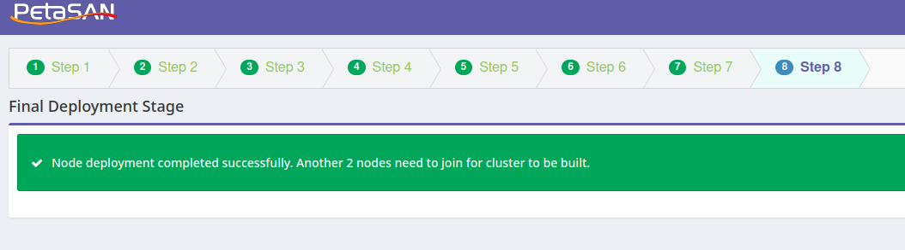

# Using PetaSAN iSCSI GWs with an external Ceph cluster

The purpose of this documentation is to describe the installation of a PetaSAN cluster using an external Ceph cluster.

We will not delve into the architecture of a PetaSAN cluster here. If you are seeking information on this topic, please refer to the official [PetaSAN documentation](https://www.petasan.org/documentation/).

> [!NOTE]
> This guide is a work in progress and can for sure be improved. Please feel free to reach out if you see anything worth correcting and/or mentioning in this guide.

## Cluster nodes and network configuration

Here are the PetaSAN's cluster nodes that we'll use in this example:

| Node | Location|	Type |	Management IP | Backend IP (Ceph side) | iSCSI portals (ESXi side) |
|------|---------|-------|----------------|---------------------------|-------------------------|
|ps-node-hw-01.foo.bar|rack1|VM|100.74.128.201|100.74.189.251|100.74.180.101 to 100.74.180.150|
|ps-node-hw-02.foo.bar|rack2|VM|100.74.130.202|100.74.189.250|100.74.180.101 to 100.74.180.150|
|ps-node-hw-03.foo.bar|rack3|VM|100.74.128.203|100.74.189.249|100.74.180.101 to 100.74.180.150|

PetaSAN will dynamically assign IPs to portals attached to 'Disks' by picking up available IPs in the range 100.74.180.101 to 100.74.180.150.

PetaSAN will handle configuring the network uniformly between the nodes. Therefore, ensure that each node is given the same number of network interfaces.

## Installing PetaSAN cluster

The installation below is to be repeated for the 3 nodes of the PetaSAN cluster.

During the installation of the first node, we will choose 'Create New Cluster'.
During the installation of the subsequent nodes, we will choose 'Join Existing Cluster'.

#### Download PetaSAN

Download the PetaSAN .ISO from [this link](https://www.petasan.org/downloads/)

#### Start the first node on the .ISO image and provide its name and Management IP as shown in the example below


#### Choose the only disk on the machine (which must be 64GB or larger in size)


#### Choose the language you want


#### Let the installation take place


#### After restarting the server, the console should display a screen similar to this one


#### Open the PetaSAN 'Deployment Wizard' at the URL indicated on the console and 'Create a new cluster' (for the first node) or Join an existing cluster (for nodes 2 and 3).


#### Choose a Cluster Name and a Password


#### Network Configuration (bonding)

As a reminder, the network configuration is indicated at the top of this page. Adjust interface names and bond mode below to your configuration / needs.

Specify on which interface to enable Jumbo Frames and enter the value of 9000 in the text field (if you use Jumbo Frames).

Click on NIC Bonding / Yes (Advanced), select interfaces eth4 to eth7, select Bond Mode / balance-xor, and set bond0 as the name, then click 'Add Bond' and proceed to the next screen.


#### Setup front and back interfaces

Choose 'bond0' as the Backend Interface, iSCSI 1 Interface, and iSCSI 2 Interface.


#### On the next screen, uncheck 'Create Default Pools' and choose 'Generic High End Hardware'. In LIO Overrides, increase the queue_depth from 128 to 512.


#### Enter the Backend IP of the Node, which will be used for traffic from the GW to Ceph.


#### On the next screen, uncheck 'Local Storage Service' to keep only 'iSCSI Target Service'


#### After a few seconds, the Deployment Wizard will indicate that the installation of the first node is complete and that you can proceed with the installation of the other two.



Repeat these steps on the other two nodes of the PetaSAN cluster

#### The installation on the last node will indicate the cluster's healthy status:


### Prevent PetaSAN from interfering with the external Ceph cluster's configuration

It is necessary to modify a script present on the PetaSAN nodes that's loaded on boot and that updates the Ceph cluster configuration. The following patch handles this configuration.

```
wget https://github.com/FredNass/ceph_petasan/blob/main/patch/disable-config-upload-onboot.patch

patch -p1 -d / < disable-config-upload-onboot.patch
```

## Connecting PetaSAN to the external Ceph cluster

During the installation, PetaSAN deployed Consul Service Mesh to operate its services and a minimalistic ceph cluster made of 3 MONs.

We will not use this embedded Ceph cluster, but it's still interesting to check its default settings, would you apply some of them to your external cluster to satisfy PetaSAN expectations.
To check the status of this embedded cluster and its settings, you can login via SSH to any PetaSAN nodes and run `ceph -s` and `ceph config dump`.

Some settings might catch your attention like `osd_heartbeat_grace=20` and `osd_heartbeat_interval=5` that were recommended in the iSCSI section of Red Hat Ceph Storage Block Device Guide.

Connecting PetaSAN to an external cluster is as simple as replacing `ceph.conf` and `ceph.client.admin.keyring` files in `/etc/ceph` directory of each PetaSAN nodes.
Before doing so, let's backup those files.

```
rsync -avh /etc/ceph/{ceph.client.admin.keyring,ceph.conf} /etc/ceph/embedded-cluster/
```

Now copy `ceph.conf` and `ceph.client.admin.keyring` files from your external cluster to the `/etc/ceph` directory of each PetaSAN nodes

```
rsync -avh /tmp/{ceph.client.admin.keyring,ceph.conf} root@ps-node-hw-01:/etc/ceph/
rsync -avh /tmp/{ceph.client.admin.keyring,ceph.conf} root@ps-node-hw-02:/etc/ceph/
rsync -avh /tmp/{ceph.client.admin.keyring,ceph.conf} root@ps-node-hw-03:/etc/ceph/
```

#### example of `ceph.conf` file
```
[global]
fsid = abcd1ef2-abcd-1ef2-abcd-1ef2abcd1ef2
mon host = [v2:100.74.100.1:3300,v1:100.74.100.1:6789],[v2:100.74.100.2:3300,v1:100.74.100.2:6789],[v2:100.74.100.3:3300,v1:100.74.100.3:6789]
mon initial members = monitor1,monitor2,monitor3
public network = 100.74.100.0/24
cluster network = 100.74.200.0/24
```

#### example of `ceph.client.admin.keyring` file
```
[client.admin]
        key = XXXXXXXXXXXXXXXXXXXXXXXXXXXXXX==
```

Next, run a `ceph -s` and login to the PetaSAN's Dashboard and check that the state and the metrics from your external Ceph cluster are properly displayed in the Dashboard (URL: https://<ip_or_fdqn_of_a_petasan_node>)

#### Route all Ceph trafic through the right interface (bond0.2206 in this example)

On every PetaSAN node, create a file `/opt/petasan/scripts/custom/post_start_network.sh` to route all Ceph trafic through the right interface (adjust values) with the below content:

`ip route add 100.74.100.0/24 via 100.74.189.254 dev bond0.2206`

## Configuring iSCSI portals

In PetaSAN Dashboard, open Configuration / iSCSI Settings and fill in the IP range in which PetaSAN will pick up IP addresses to assign to iSCSI portals / Disks. Do not forget to set the vlan id (2211 in this example) if needed.


If the wizard asks for a second IP range for iSCSI 2 Subnet, simply add a single IP range (for example 100.74.180.151) in the text area.

**That's it! Now all you need is to 'Managed iSCSI Disks / iSCSI Disks / Add iSCSI Disk' in the PetaSAN Dashboard to create and export new LUNs.**

## IMPORTANT TO KNOW

- VMFS uses a default block size of 1MB while RBD uses a default object size of 4MB. If you want to align RBD object size with VMFS block size, you can precreate RBD images with a 1MB object size and export these images as 'Disks' from the PetaSAN Dashboard at a later time.
  ```
  rbd create rbd/image-00001 --size 10T --object-size 1M --image-format 2 --image-feature layering
  ```

- To benefit from VMware VAAI extensions like XCOPY offloading that speeds up Storage vMotion tasks, make sure that each PetaSAN Gateway has an active path to all datastore's Disks.

- There's a risk of data corruption when using SUSE based iSCSI implementation that's been described [here](https://croit.io/blog/fixing-data-corruption).
  But... You should be safe with PetaSAN as:
  - PetaSAN < v3.3 won't load RBD images with 'object-map' feature enabled
  - PetaSAN > v3.3 will set the emulate_legacy_capacity flag that - if I understood correctly - prevents data corruption from occuring when 'object-map' feature is enabled on RBD images.

## TUNING

PetaSAN disabled the use of C-states for performance reasons. If your PetaSAN nodes are Virtual Machines, they will appear as consumming 100% CPU time from the hypervisor perspective.
If your workload does not require that level of optimization and you prefer to release CPU pressure on hypervisors, you may want to allow CPUs to enter idle state (c-state C1) by editing files /etc/rc.local and /opt/petasan/scripts/tuning/tuning.sh as per below :

```
#Patch to allow PetaSAN nodes CPUs to enter idle mode (C1) and avoid high CPU usage on hypervisors
#cpupower idle-set -D 0
cpupower idle-set -D 1
```
Reboot the node and verify the application at reboot by running `cpupower monitor` and `cat /sys/module/intel_idle/parameters/max_cstate`

## FAQ

- Why does the installation of the 3rd node never ends?

  The most likely issue is that PetaSAN's Ceph monitors (that we won't use) are unable to establish their quorum due to a clock skew between the three nodes.
  This can be verified by checking the /var/log/ceph/ceph.log file on all 3 nodes.
  Nodes' clocks can be adjusted by running the below commands:
  ```
  systemctl stop ntp && ntpdate pool.ntp.org && systemctl start ntp
  ```
  
- Any particular configuration to set up on VMware side?

  Yes. Please check [this documentation](VMWARE.md).
  
- Where does PetaSAN cluster stores its logs?

  Cluster logs are recorded in file /opt/petasan/log/PetaSAN.log on PetaSAN nodes.

- How can I check LIO target configuration?
  On PetaSAN node run the below command
  ```
  targetcli-fb ls
  ```

  Should I edit it from here? No. Use the Dashboard.
  
- Where is this configuration stored?

  On PetaSAN nodes in file `/etc/target/saveconfig.json`. Should I edit it from here? No. Use the Dashboard to configure exports.

- Any LIO tunings?

  Yes, in file `/opt/petasan/config/tuning/current/lio_tunings`. Can I edit this file? Yes you can, just make sure all nodes use the same settings and reboot each node one after the other (rebalancing the paths between them) after tuning.
